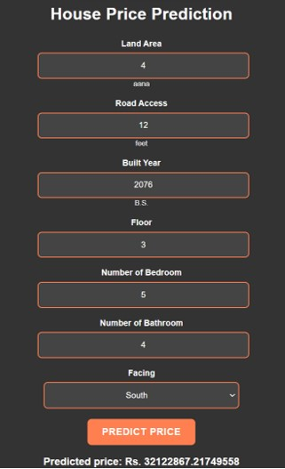

# 🏠💰 House Price Prediction

This project, titled **"House Price Prediction"**, is a machine learning solution designed to accurately estimate housing prices. By leveraging the power of machine learning algorithms, this model aims to assist prospective homebuyers, real estate agents, and investors in making well-informed decisions regarding property investments. 🚀

Our achievement lies in the development of a predictive model that considers various crucial factors influencing housing prices, such as road width, land area, and square footage. 📊

---

## 🎯 Key Features

* **Accurate Price Prediction:** Utilizes machine learning to estimate house prices with a high degree of accuracy.
* **Feature Consideration:** Takes into account various factors like road width, land area, and square footage to make predictions.
* **Potential for Informed Decisions:** Empowers users with insights for better property investment choices.

---

## 📸 Application Screenshots

| Feature | Screenshot |
|---------|-----------|
| **House Price Prediction** |  |

---

## ⚠️ Limitations

* Limited accuracy in predicting house prices outside the dataset's well-represented geographic areas.
* Potential inaccuracies due to outdated or unreliable data may affect model performance.
* Dependence on specific features might limit predictions for properties with incomplete attribute data.
* Lack of real-time updates may hinder the model's adaptability to rapidly changing real estate market dynamics.

---

## ✨ Future Enhancements

* Implement an admin panel for ongoing data management, ensuring dataset relevance and accuracy.
* Integrate a user feedback system to collect insights for continuous model improvement.
* Incorporate mechanisms for capturing real-time market updates.

---

## 🧑‍💻 Authors

* Shashwat Khadka 
* Shubin Pokhrel 
* Siddhartha Lal Pradhan 
* Binaya Raj Thapa 

---

## Contributing 🤝
Contributions are welcome! If you have any suggestions, bug reports, or feature requests, please open an issue or submit a pull request.

---